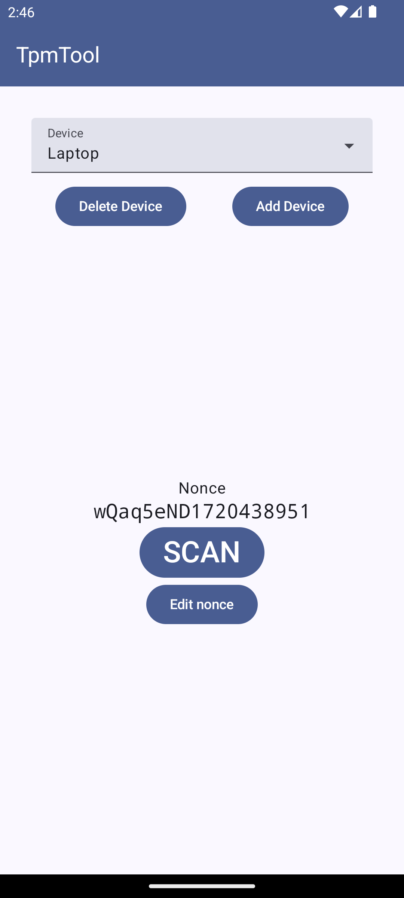
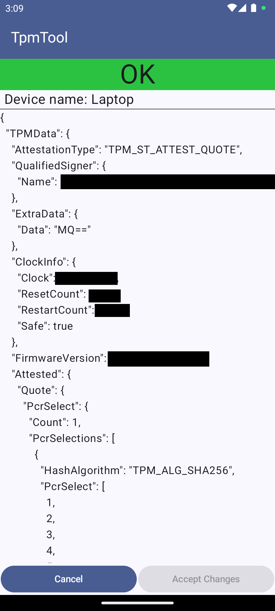

# tpmTool for android
Validate tpm2.0 quotes on android. Useful for validating system integrity using the process of attestation.

| Overview Page          | Event details page     |
|------------------------|------------------------|
|  |  |

## How to use
The application is primarily intended to be used with this [initcpio hook](https://github.com/Kioubit/mkinitcpio-attestation).
However, other use cases are conceivable as well.
